# Modelagem do Sistema

Este documento apresenta os diagramas de arquitetura, fluxos e modelos de dados do projeto Meraki Ansible.

---

## Modelos de Dados

### Relacionamentos entre Entidades

```
ORGANIZATION  1──────N  NETWORK
NETWORK       1──────N  SSID
NETWORK       1──────N  ACCESS_POINT
ACCESS_POINT  N──────1  RF_PROFILE (opcional)
```

### ORGANIZATION

| Campo | Tipo | Descricao |
|-------|------|-----------|
| id | string | Identificador unico (PK) |
| name | string | Nome da organizacao |
| timezone | string | Fuso horario |
| notes | string | Observacoes |
| api_enabled | boolean | API habilitada |

### NETWORK

| Campo | Tipo | Descricao |
|-------|------|-----------|
| id | string | Identificador unico (PK) |
| organization_id | string | ID da organizacao (FK) |
| name | string | Nome da rede |
| product_types | string | Tipos de produto |
| timezone | string | Fuso horario |
| tags | string | Tags de classificacao |
| notes | string | Observacoes |

### SSID

| Campo | Tipo | Descricao |
|-------|------|-----------|
| number | int | Numero do SSID 0-14 (PK) |
| network_id | string | ID da rede (FK) |
| name | string | Nome do SSID |
| enabled | boolean | SSID ativo |
| auth_mode | string | Modo de autenticacao |
| encryption_mode | string | Modo de criptografia |
| wpa_encryption_mode | string | Versao WPA |
| psk | string | Senha pre-compartilhada |
| ip_assignment_mode | string | Modo de atribuicao IP |
| default_vlan_id | int | VLAN padrao |

### ACCESS_POINT

| Campo | Tipo | Descricao |
|-------|------|-----------|
| serial | string | Numero de serie (PK) |
| network_id | string | ID da rede (FK) |
| name | string | Nome do AP |
| mac | string | Endereco MAC |
| model | string | Modelo do AP |
| tags | string | Tags de classificacao |
| lat | float | Latitude |
| lng | float | Longitude |
| address | string | Endereco fisico |
| notes | string | Observacoes |
| rf_profile_id | string | ID do perfil RF (FK) |

### RF_PROFILE

| Campo | Tipo | Descricao |
|-------|------|-----------|
| id | string | Identificador unico (PK) |
| network_id | string | ID da rede (FK) |
| name | string | Nome do perfil |
| band_settings | string | Configuracoes de banda |

---

## Arquitetura do Sistema

### Visao Geral

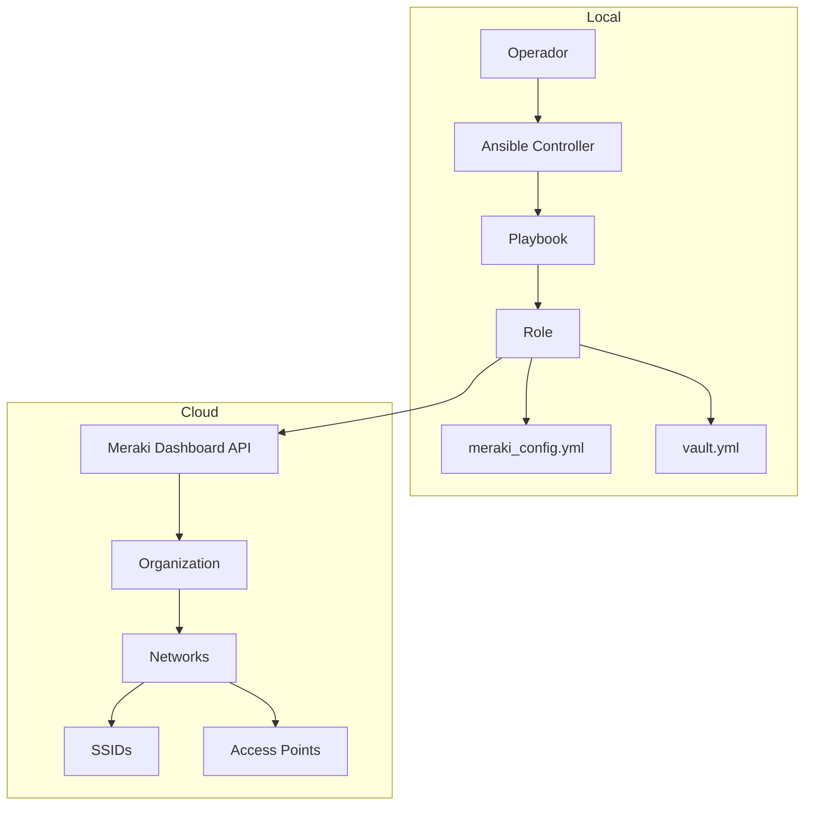

### Componentes

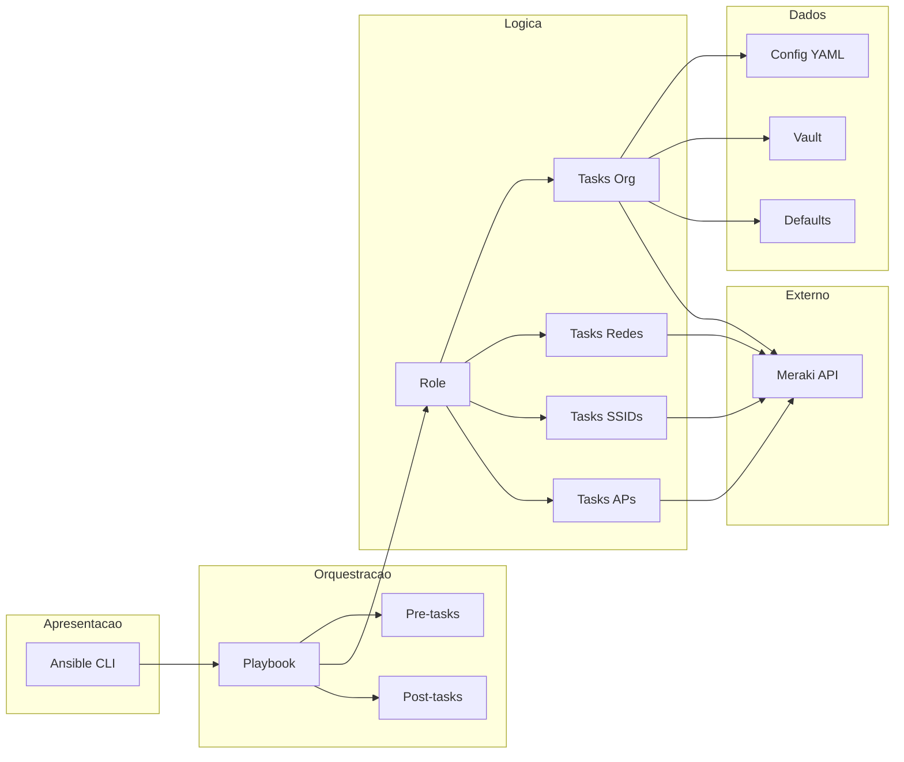

---

## Fluxo de Autenticacao

### Validacao da API Key

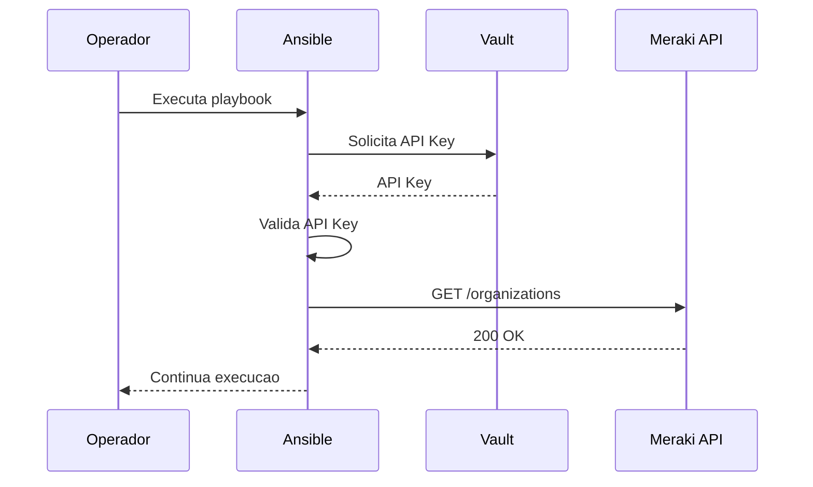

### Processo de Descriptografia

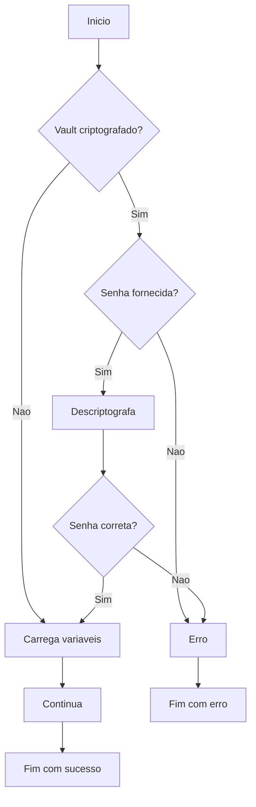

---

## Fluxo de Provisionamento

### Fluxo Principal

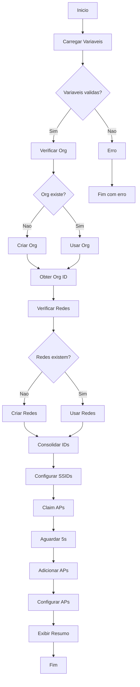

### Criacao de Rede

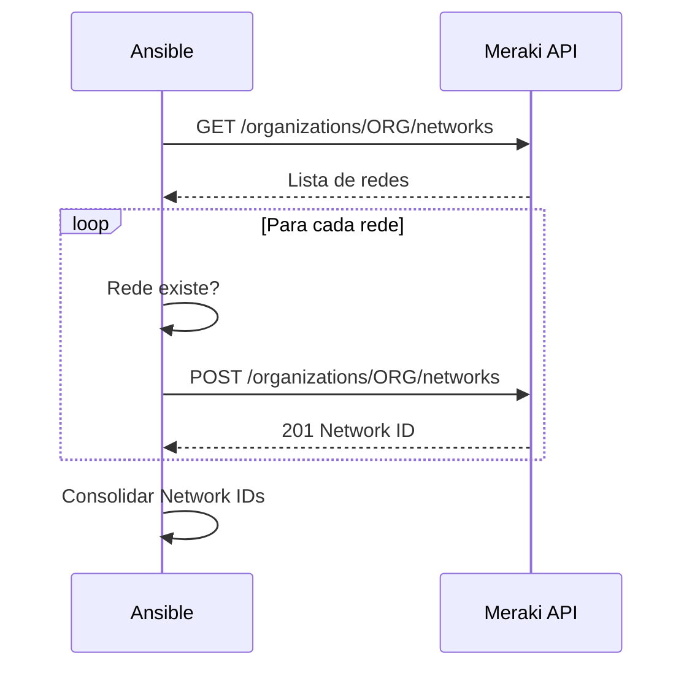

---

## Fluxo de Configuracao de SSIDs

### Processo de Configuracao

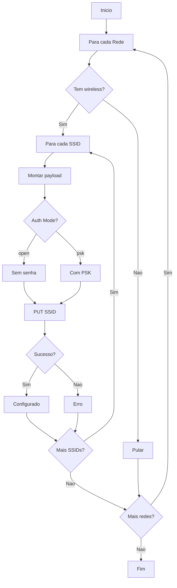

---

## Fluxo de Access Points

### Claim e Configuracao

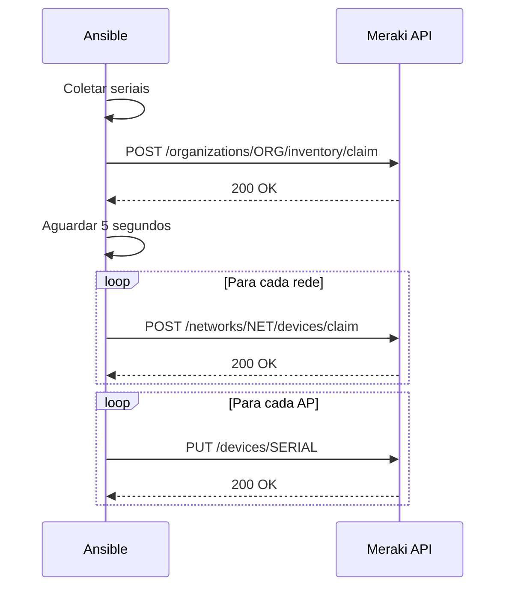

---

## Fluxo de Seguranca

### Ciclo de Vida de Credenciais

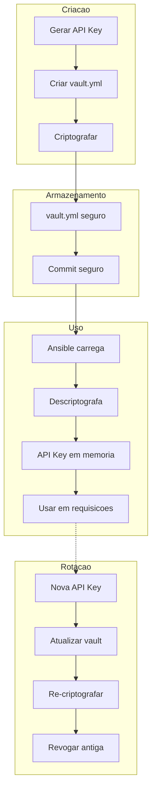

### Validacao de Entrada

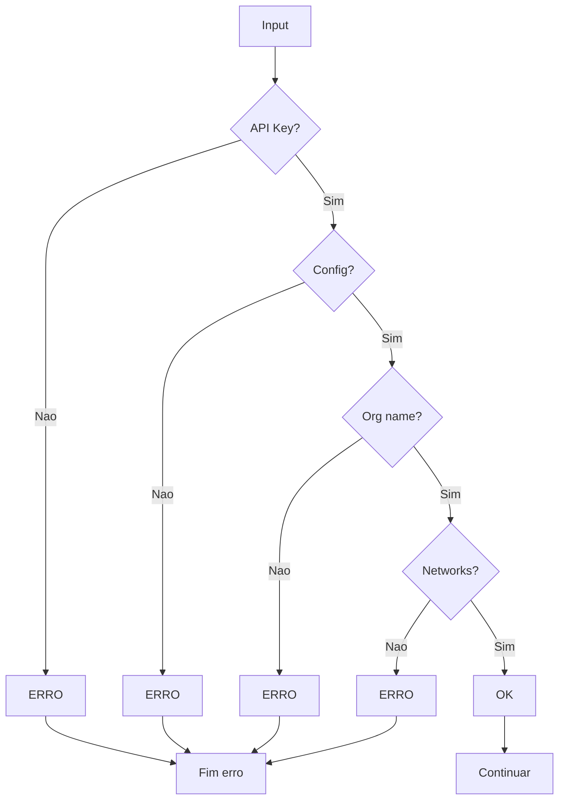

---

## Diagrama de Estados

### Estados do Provisionamento

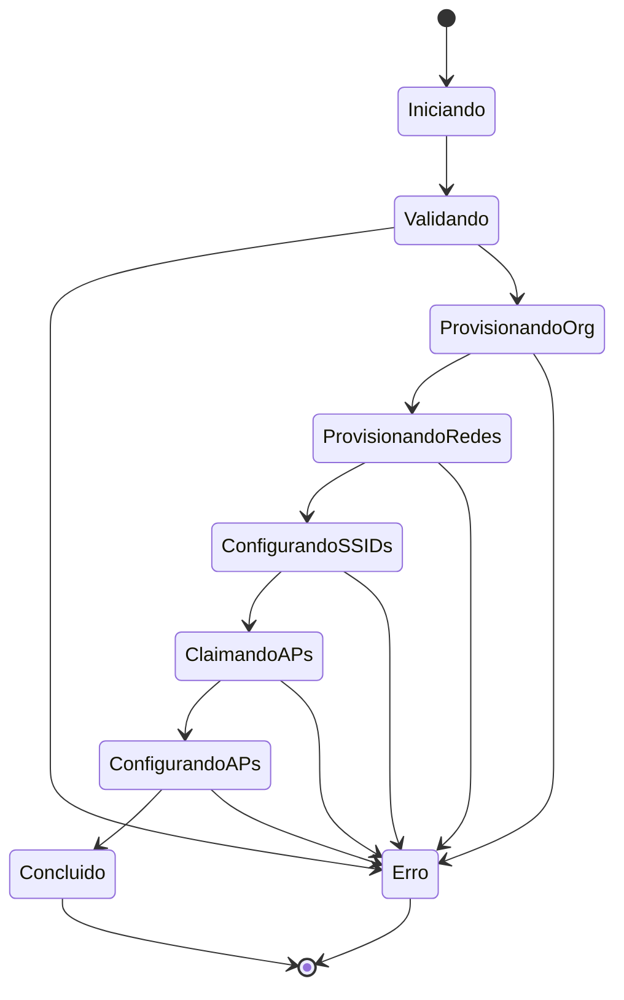

---

## Proximos Passos

- Consulte [Autenticacao e Seguranca](authentication.md) para detalhes de seguranca
- Veja [Desenvolvimento](development.md) para contribuir com o projeto
