# Modelagem do Sistema

Este documento apresenta os diagramas de arquitetura, fluxos e modelos de dados do projeto Meraki Ansible.

## Modelos de Dados

### Diagrama Entidade-Relacionamento (ERD)

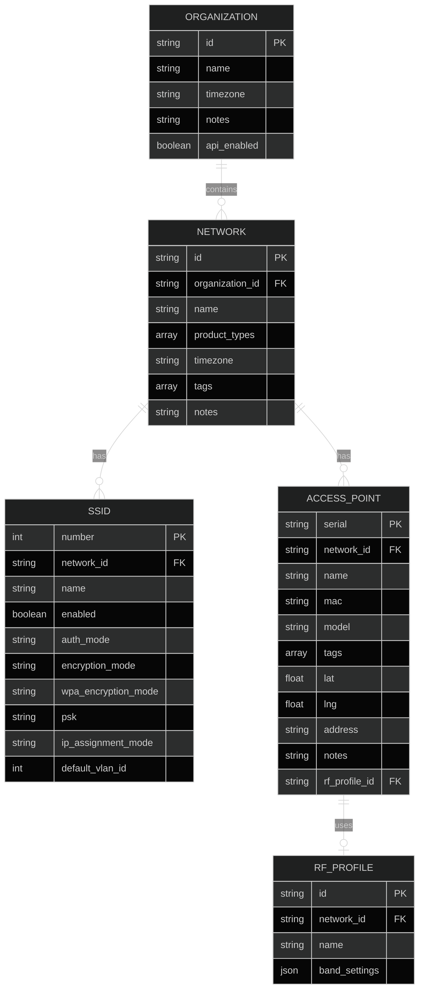

## Arquitetura do Sistema

### Visão Geral da Arquitetura

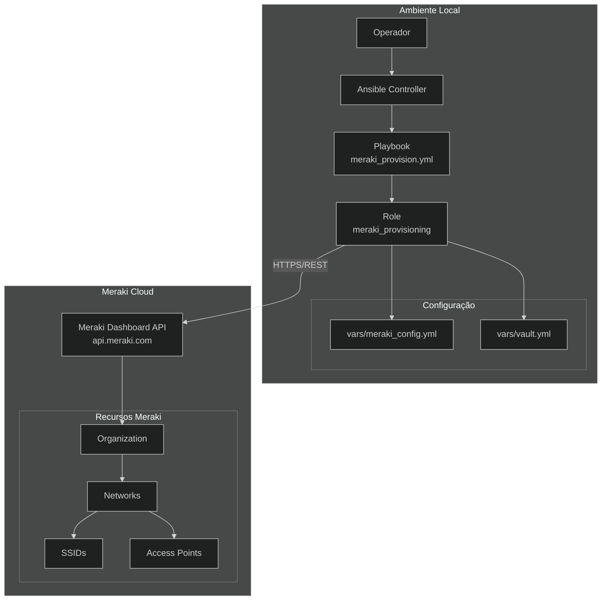

### Componentes do Sistema

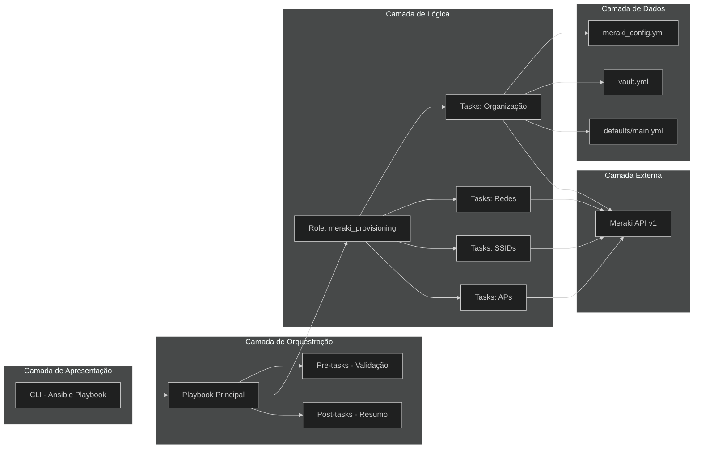

## Fluxo de Autenticação

### Fluxo de Validação da API Key

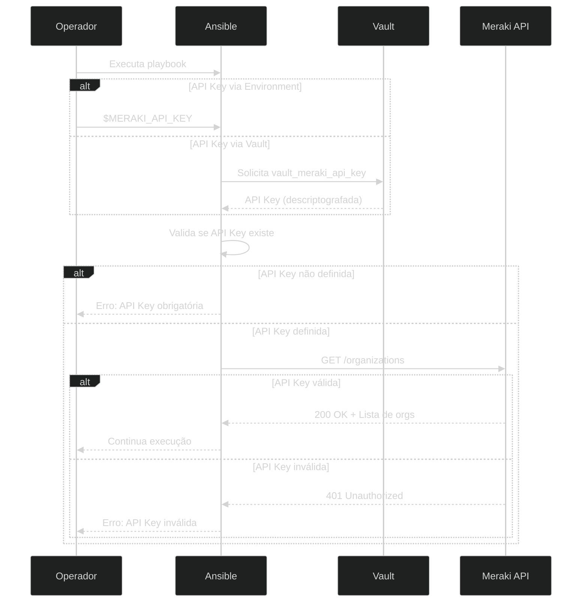

### Processo de Descriptografia do Vault

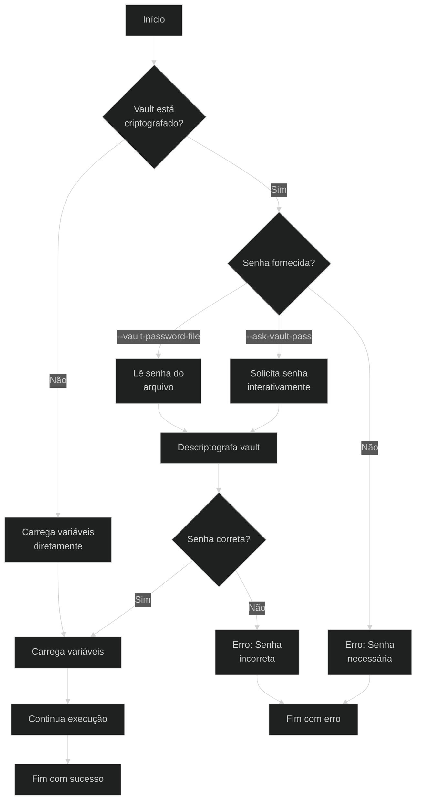

## Fluxo de Provisionamento

### Fluxo Principal de Execução

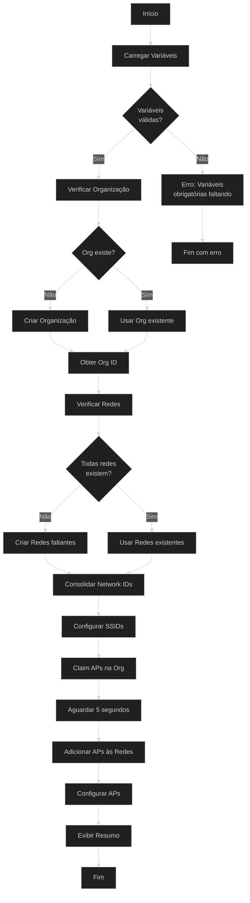

### Fluxo Detalhado de Criação de Rede

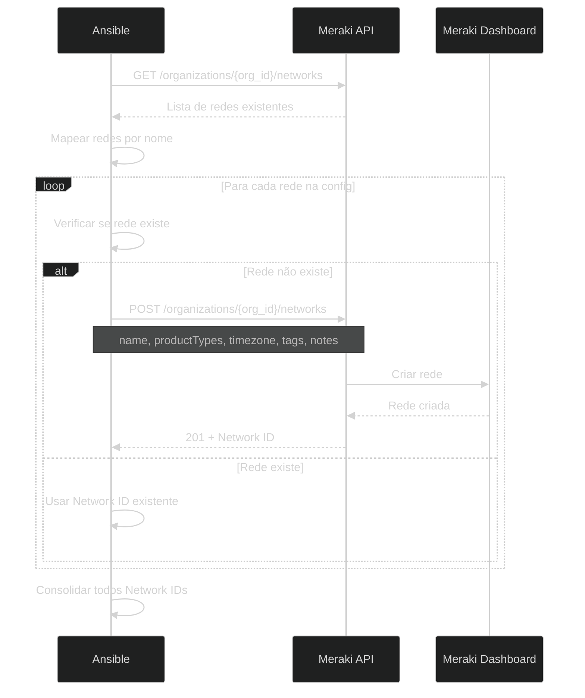

## Fluxo de Configuração de SSIDs

### Processo de Configuração de SSID

```mermaid
%%{init: {'theme': 'dark'}}%%
flowchart TD
    A[Início SSID Config] --> B[Para cada Rede]
    B --> C{Rede tem<br/>wireless?}

    C -->|Não| D[Pular rede]
    C -->|Sim| E[Para cada SSID]

    E --> F[Montar payload]

    F --> G{Auth Mode?}
    G -->|open| H[Sem senha]
    G -->|psk| I[Incluir PSK]

    H --> J[PUT /networks/{id}/wireless/ssids/{n}]
    I --> J

    J --> K{Sucesso?}
    K -->|Sim| L[SSID configurado]
    K -->|Não| M[Registrar erro]

    L --> N{Mais SSIDs?}
    M --> N

    N -->|Sim| E
    N -->|Não| O{Mais redes?}

    D --> O
    O -->|Sim| B
    O -->|Não| P[Fim]
```

## Fluxo de Provisionamento de Access Points

### Fluxo de Claim e Configuração de APs

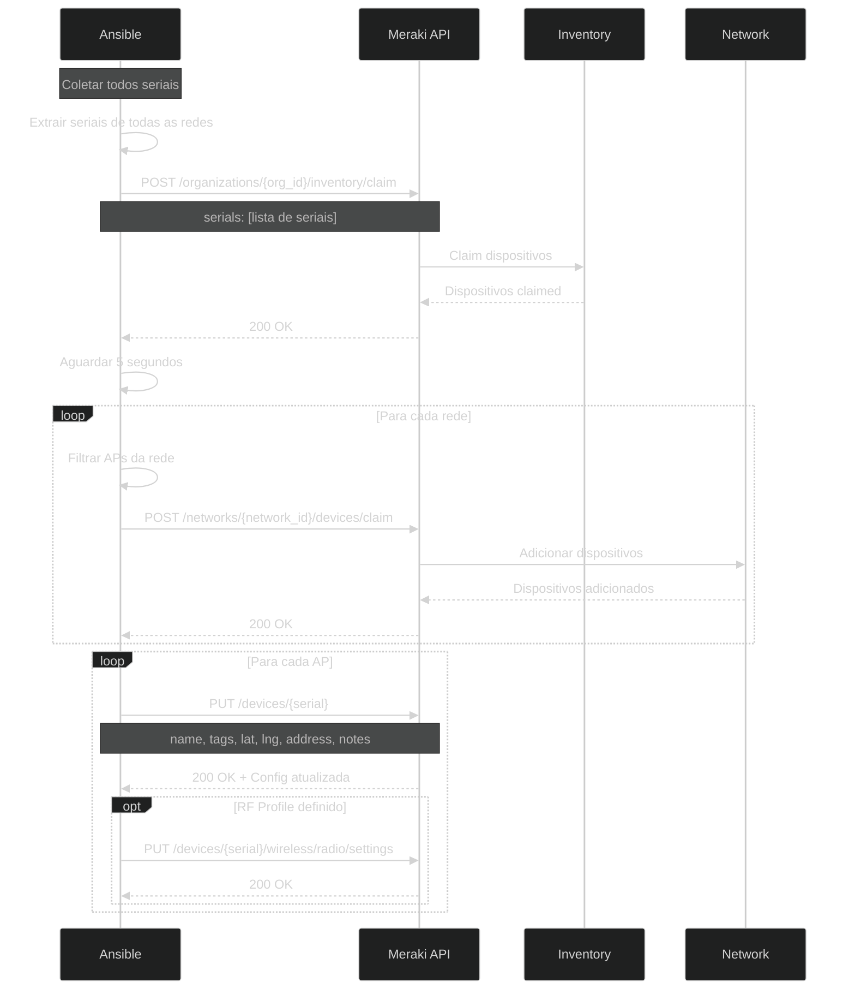

## Fluxo de Segurança

### Ciclo de Vida de Credenciais

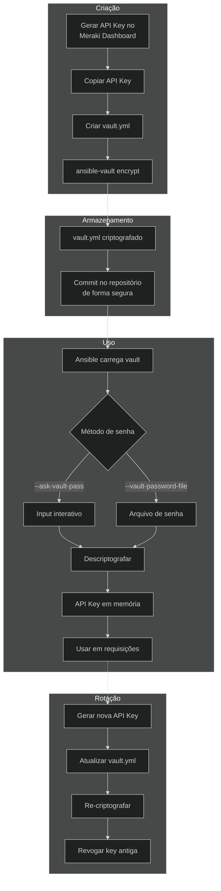

### Validação de Entrada

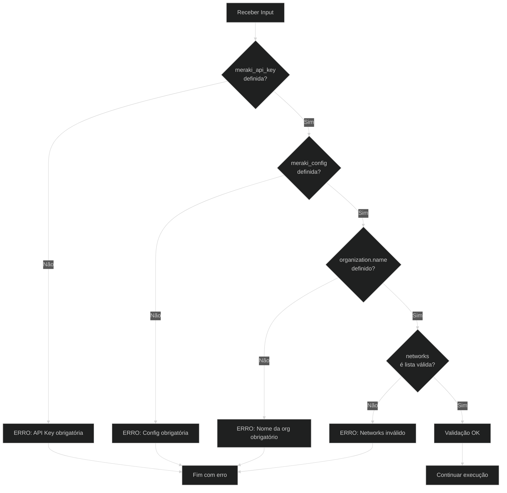

## Diagrama de Estados

### Estados do Provisionamento

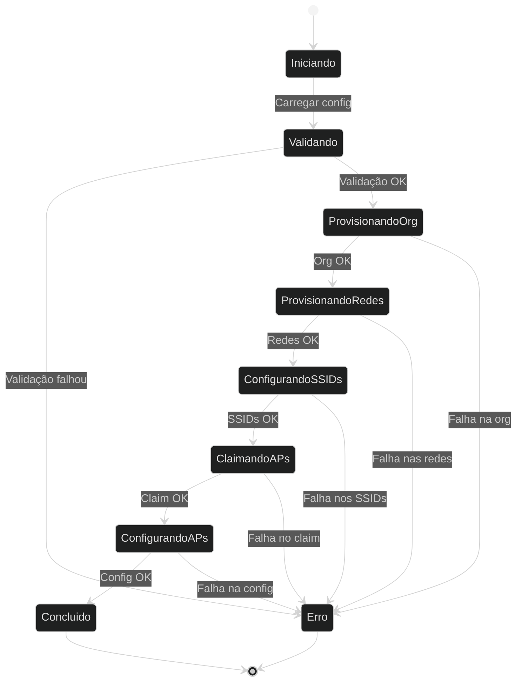

## Diagrama de Componentes

### Interação entre Componentes

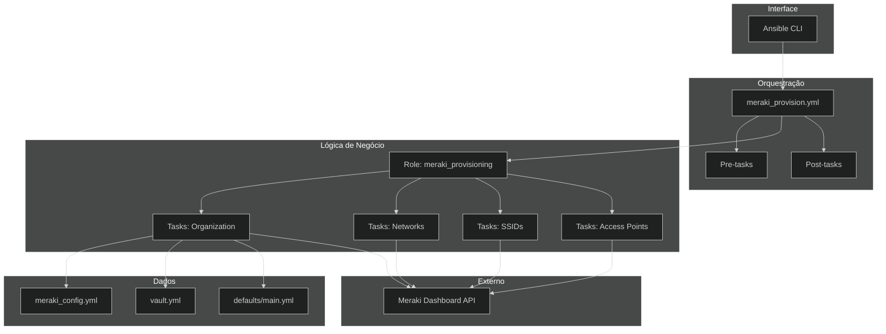

## Próximos Passos

- Consulte [Autenticação e Segurança](authentication.md) para detalhes de segurança
- Veja [Desenvolvimento](development.md) para contribuir com o projeto
