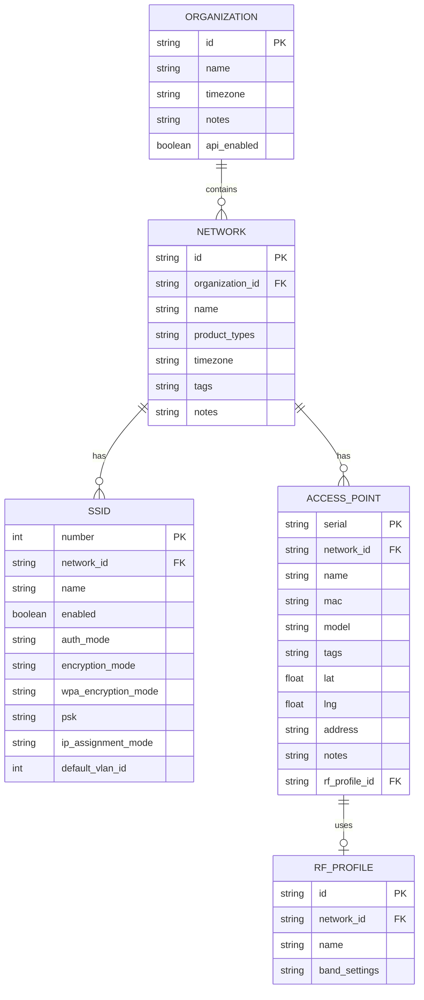
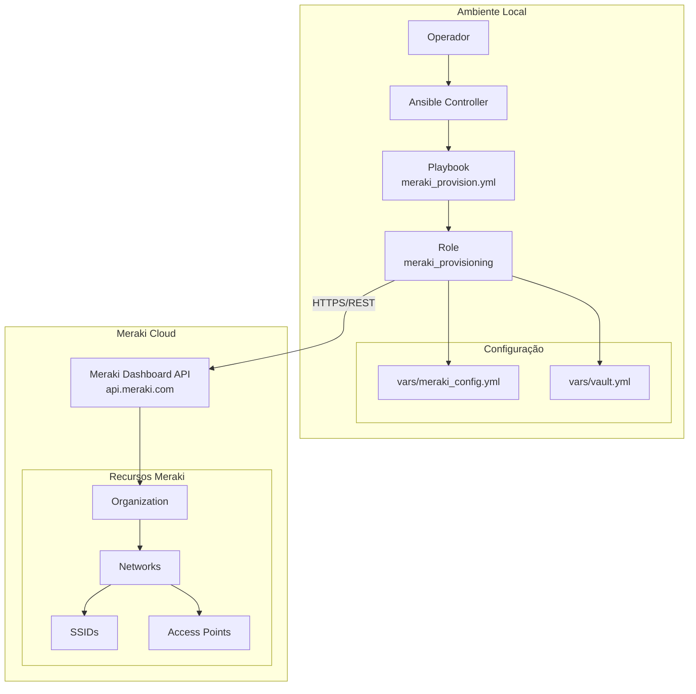

# Modelagem do Sistema

Este documento apresenta os diagramas de arquitetura, fluxos e modelos de dados do projeto Meraki Ansible.

```mermaid
%%{init: {
  "theme": "base",
  "themeVariables": {
    "background": "#2b2b2b",
    "primaryColor": "#3a3a3a",
    "primaryBorderColor": "#555555",
    "primaryTextColor": "#f5f5f5",
    "secondaryColor": "#444444",
    "secondaryBorderColor": "#666666",
    "secondaryTextColor": "#f5f5f5",
    "tertiaryColor": "#505050",
    "lineColor": "#bbbbbb",
    "textColor": "#f5f5f5",
    "mainBkg": "#3a3a3a",
    "nodeBorder": "#777777",
    "clusterBkg": "#353535",
    "clusterBorder": "#666666",
    "edgeLabelBackground": "#2b2b2b",
    "fontFamily": "monospace"
  }
}}%%
```

---

## Modelos de Dados

### Diagrama Entidade-Relacionamento (ERD)



---

## Arquitetura do Sistema

### Visão Geral da Arquitetura



---

## Fluxo de Configuração de SSIDs

### Processo de Configuração de SSID (Corrigido)

```mermaid
flowchart TD
    A[Início Configuração SSIDs] --> B[Para cada Network ID]
    B --> C{Network possui<br/>produto wireless?}

    C -->|Não| D[Pular network]
    C -->|Sim| E[Para cada SSID definido<br/>na meraki_config.yml]

    E --> F[Definir número do SSID (0-14)]
    F --> G[Montar payload completo]

    G --> H{auth_mode}
    H -->|open| I[Remover campos de senha]
    H -->|psk| J[Incluir encryptionMode e psk]

    I --> K[PUT /networks/{network_id}/wireless/ssids/{number}]
    J --> K

    K --> L{Status 200?}
    L -->|Sim| M[SSID atualizado com sucesso]
    L -->|Não| N[Registrar erro e continuar]

    M --> O{Há mais SSIDs?}
    N --> O

    O -->|Sim| E
    O -->|Não| P{Há mais networks?}

    D --> P
    P -->|Sim| B
    P -->|Não| Q[Fim]
```

---

## Próximos Passos

- Consulte `authentication.md` para detalhes de segurança
- Veja `development.md` para contribuir com o projeto
