# Modelagem do Sistema

Este documento apresenta os diagramas de arquitetura, fluxos e modelos de dados do projeto Meraki Ansible.

## Modelos de Dados

### Diagrama Entidade-Relacionamento (ERD)

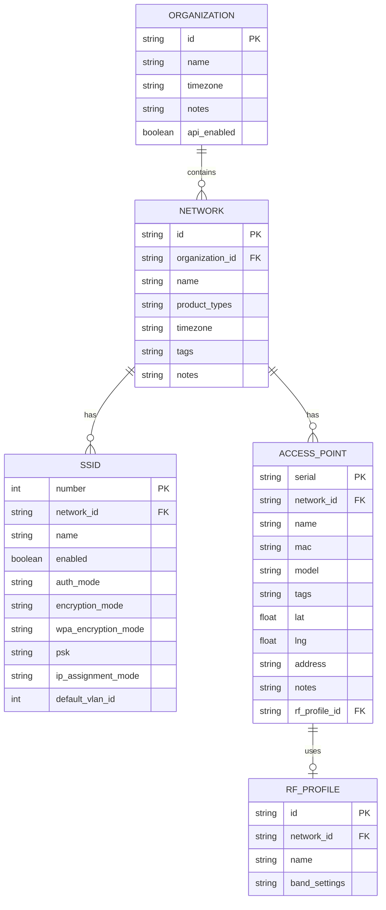

## Arquitetura do Sistema

### Visao Geral da Arquitetura

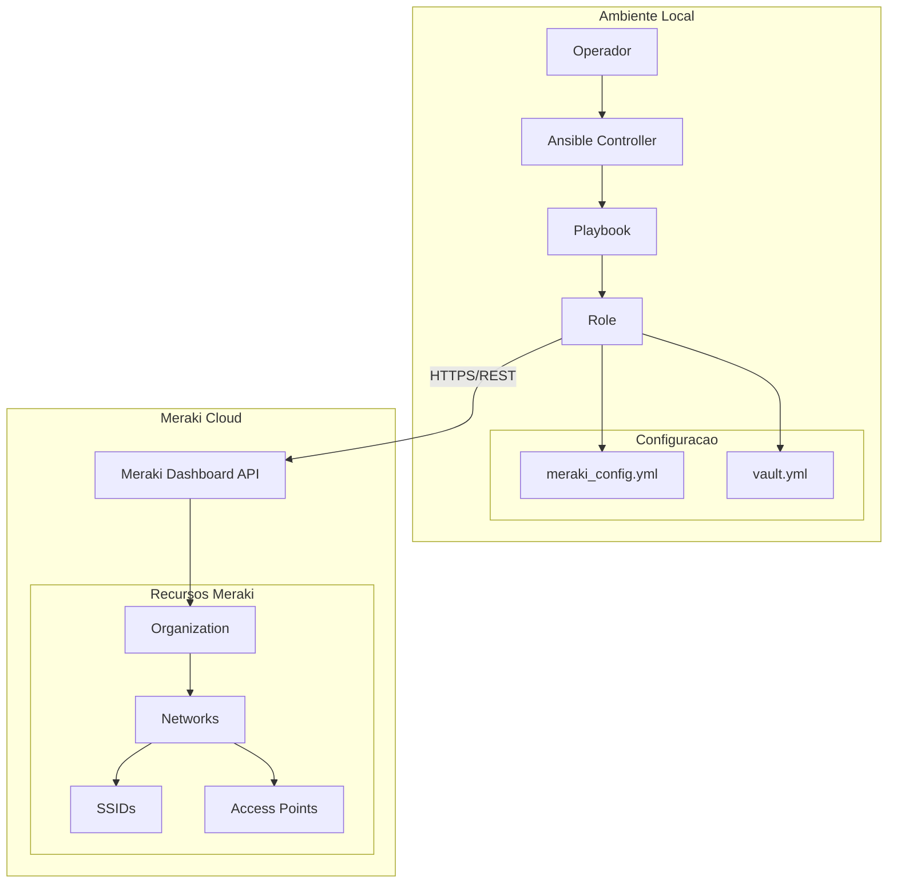

### Componentes do Sistema

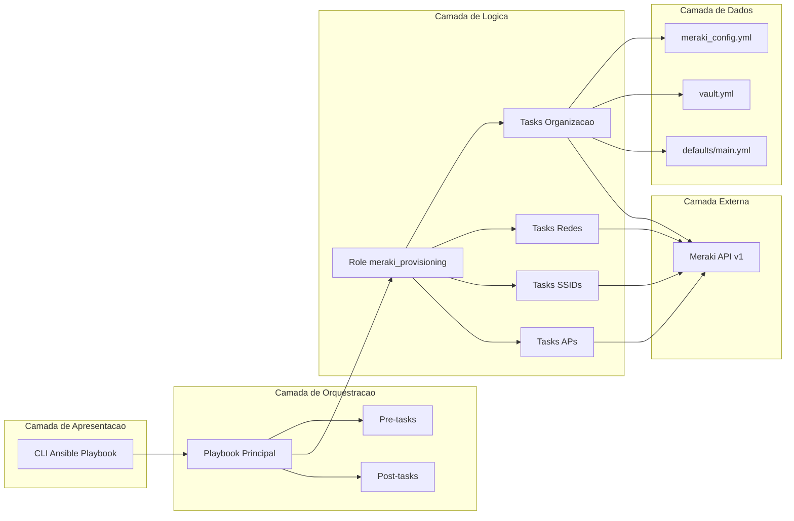

## Fluxo de Autenticacao

### Fluxo de Validacao da API Key

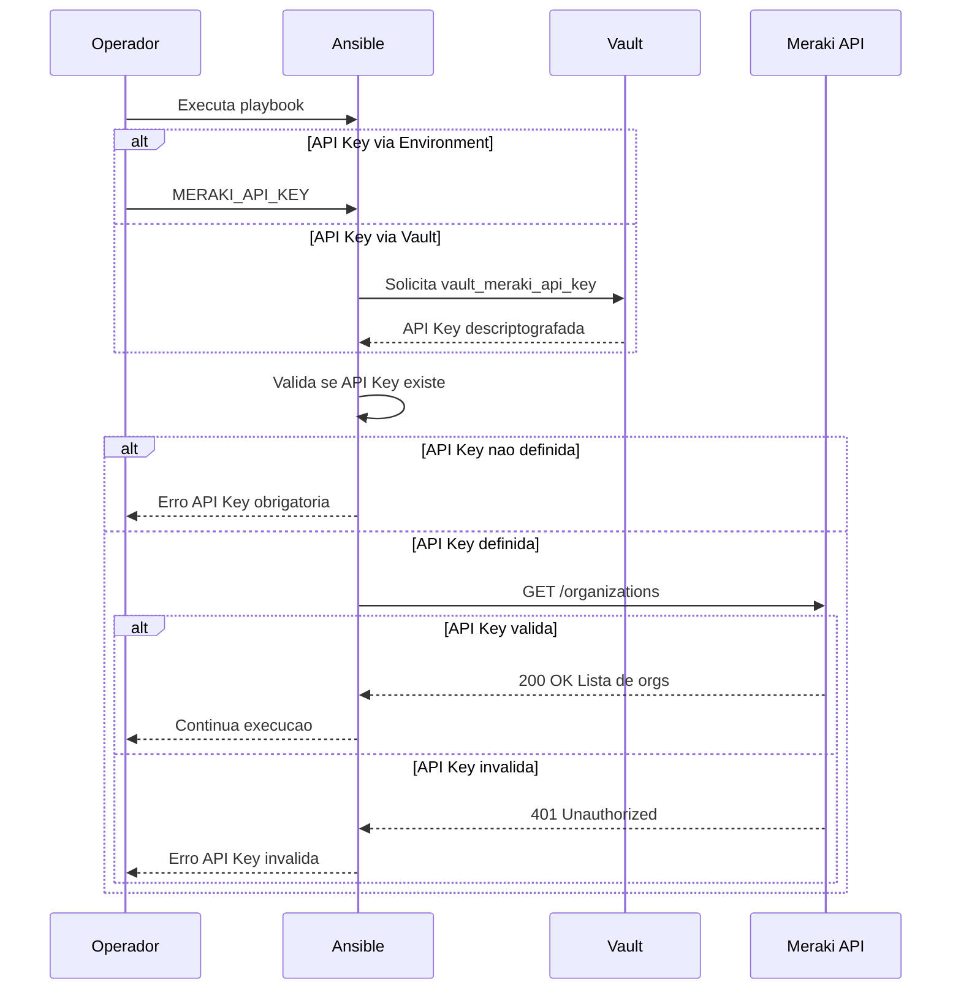

### Processo de Descriptografia do Vault

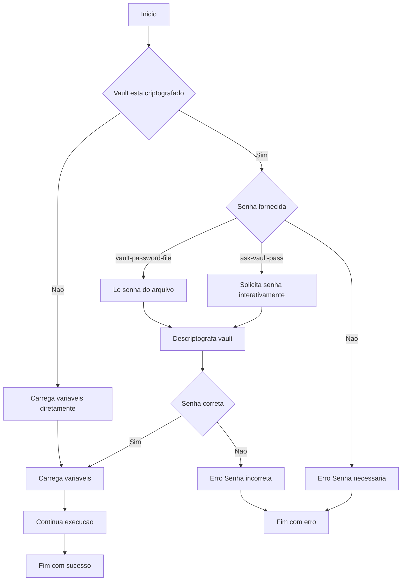

## Fluxo de Provisionamento

### Fluxo Principal de Execucao

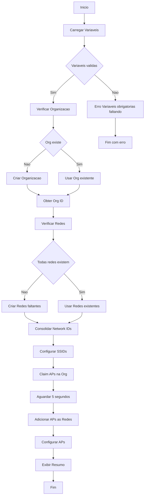

### Fluxo Detalhado de Criacao de Rede

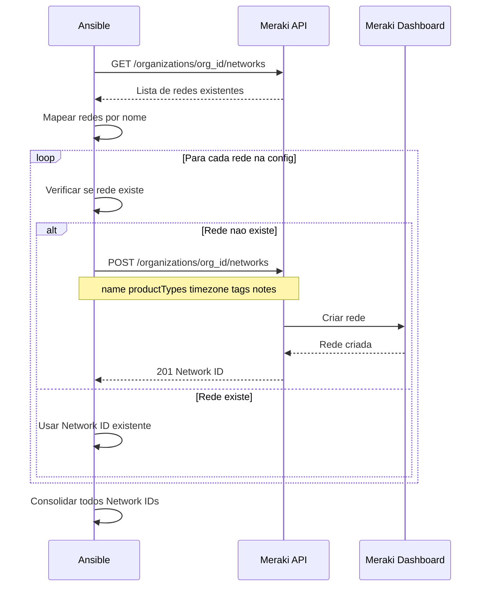

## Fluxo de Configuracao de SSIDs

### Processo de Configuracao de SSID

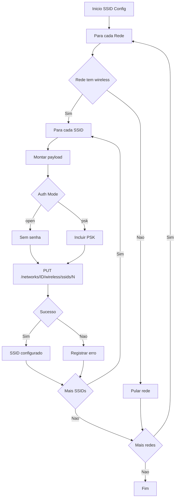

## Fluxo de Provisionamento de Access Points

### Fluxo de Claim e Configuracao de APs

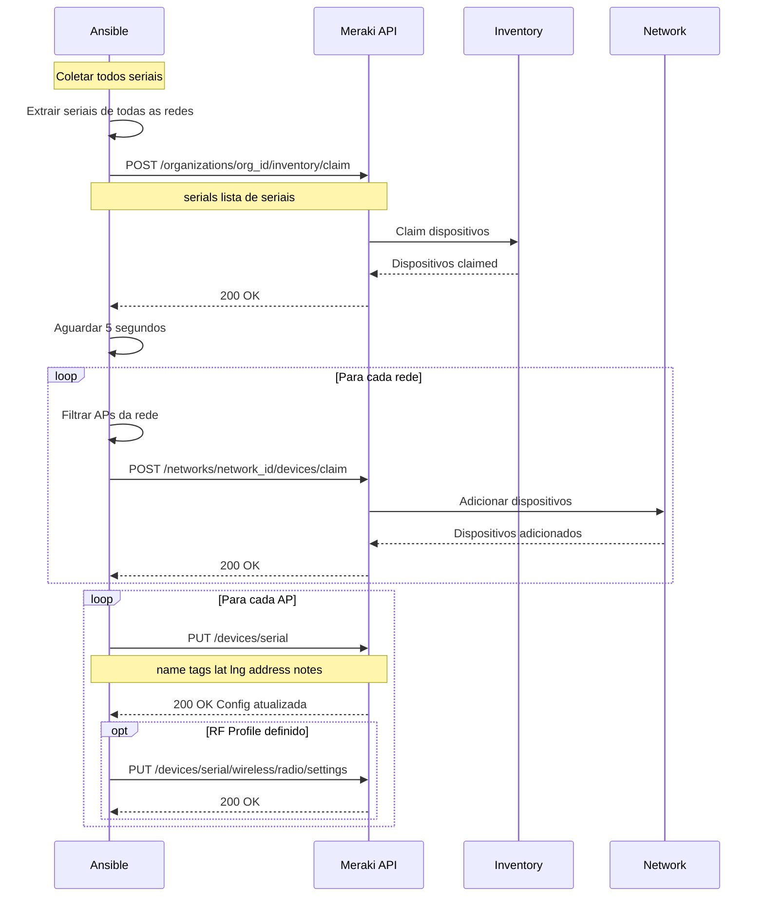

## Fluxo de Seguranca

### Ciclo de Vida de Credenciais

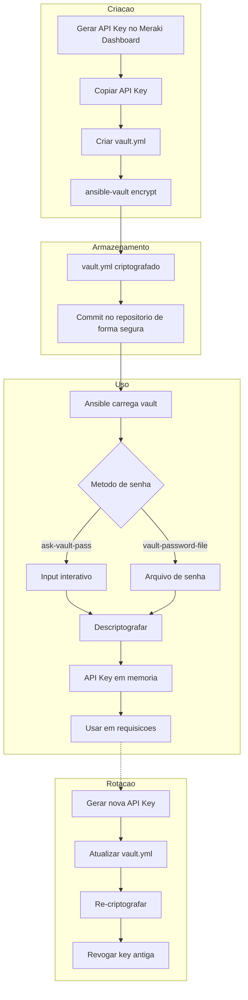

### Validacao de Entrada

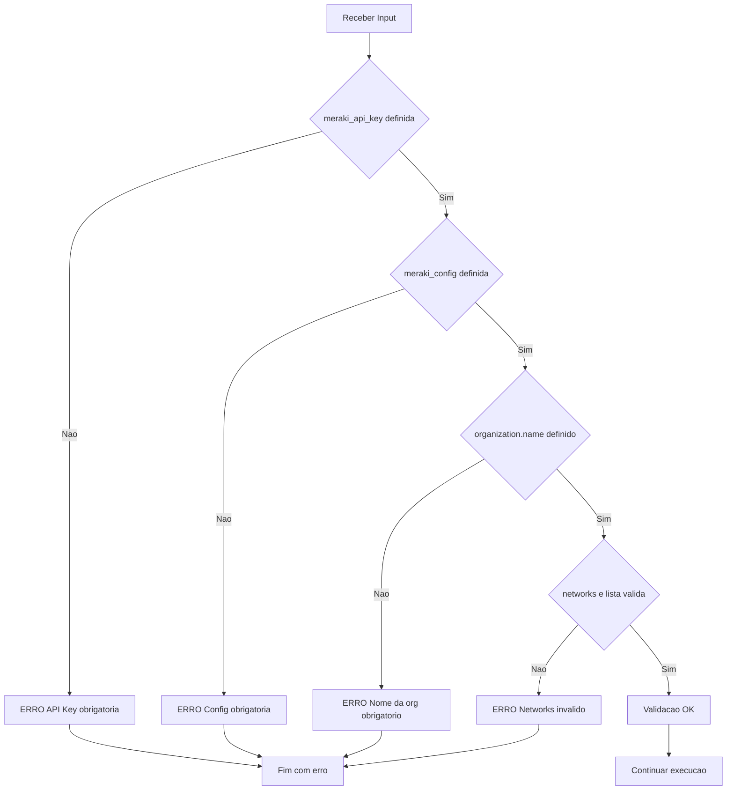

## Diagrama de Estados

### Estados do Provisionamento

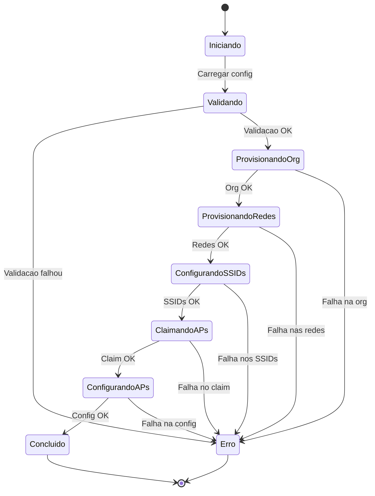

## Diagrama de Componentes

### Interacao entre Componentes

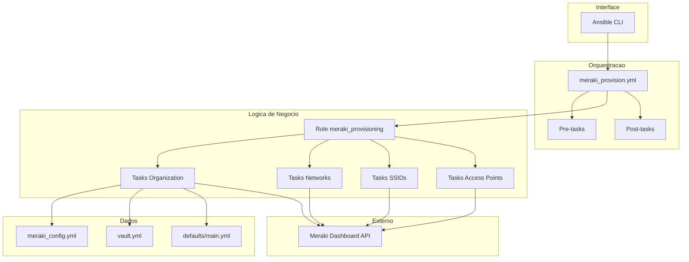

## Proximos Passos

- Consulte [Autenticacao e Seguranca](authentication.md) para detalhes de seguranca
- Veja [Desenvolvimento](development.md) para contribuir com o projeto
